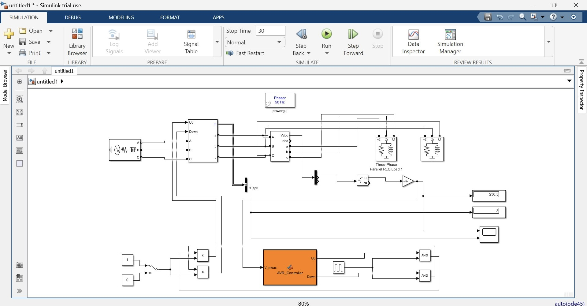
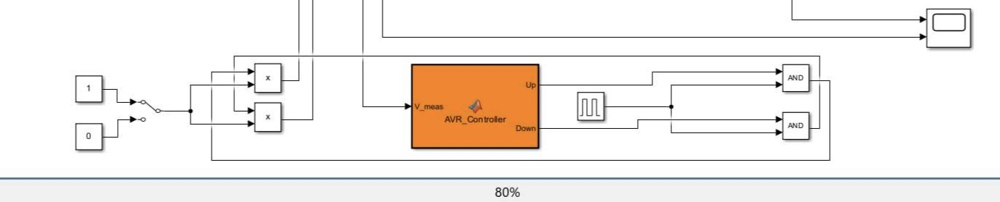
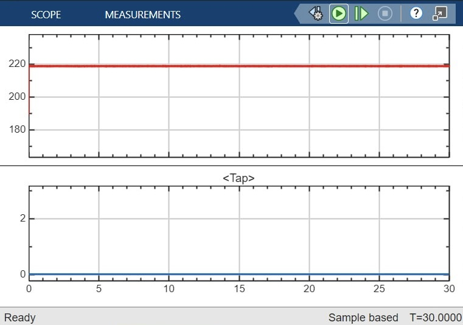
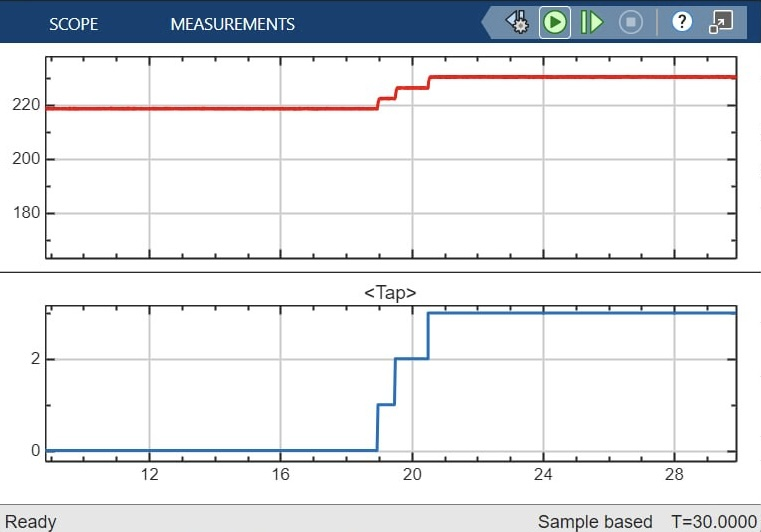
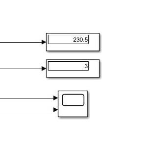
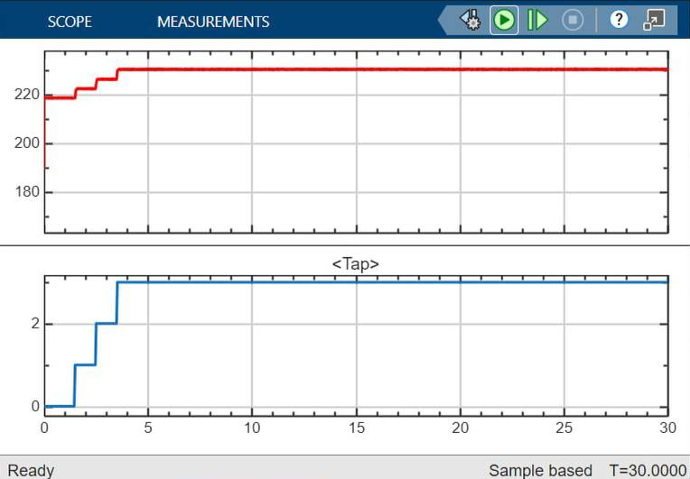
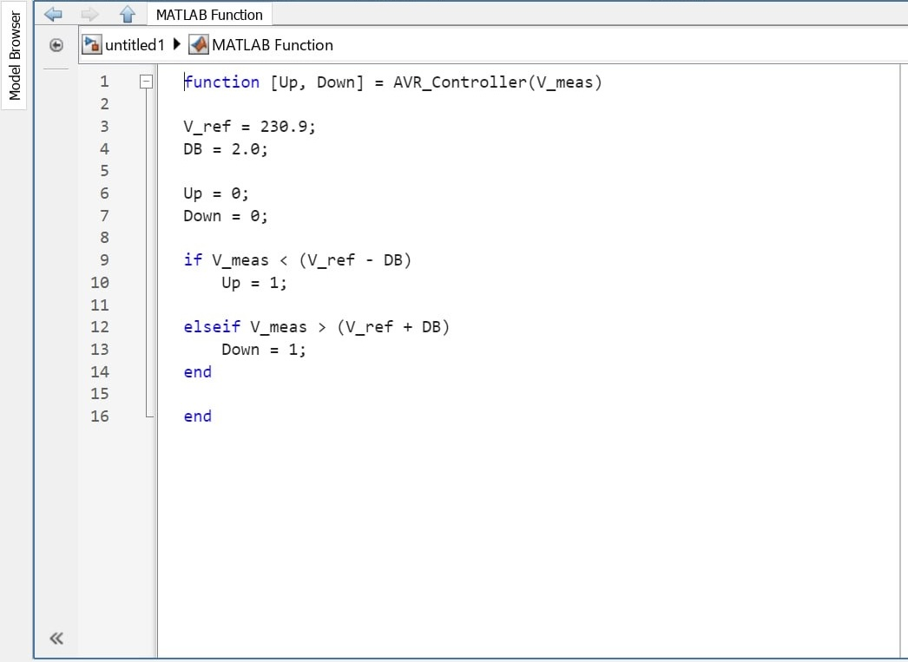

# Design and Simulation of an Automatic Voltage Regulator (AVR) for a Distribution Transformer Using OLTC

## About The Project
This repository contains the simulation files and technical documentation for my Electrical Engineering graduation project. The project focuses on stabilizing power distribution networks by designing and simulating an Automatic Voltage Regulator (AVR) integrated with an On-Load Tap Changer (OLTC) for distribution transformers.

## Software & Tools Used
* **MATLAB & Simulink:** For dynamic system modeling and simulation.
* **ETAP:** For electrical power system analysis.
* **AutoCAD:** For schematics and block diagrams.

## Key Objectives
* Simulate voltage fluctuations in a distribution network.
* Design a control logic for the OLTC to automatically adjust tap positions.
* Analyze system stability and voltage regulation performance before and after AVR integration.

## Repository Contents
* `/Simulink_Models`: Contains the `.slx` files for the AVR and OLTC simulation.
* `/Results`: Contains graphical plots showing voltage stability and system response.
* `/Documentation`: Project abstract and technical presentation — [📄 Download PDF](./MMO_Graduation_Project)

## Simulation & Results

### 1. Overall System Model

> The overall MATLAB/Simulink model of the proposed AVR-OLTC distribution system.

### 2. Control Logic Architecture

> Internal architecture of the symmetrical logic control showing AND gates synchronization.

### 3. System Response Without AVR

> System response under heavy loading without AVR activation (Voltage at 0.95 p.u.).

### 4. Dynamic Response With AVR

> Dynamic response of the AVR showing the 3-step tap transition and voltage restoration to 1.0 p.u.

### 5. Steady-State Measurements

> Digital measurement displays showing steady-state regulated voltage and final tap position.

### 6. Steady-State Voltage Profile

> Steady-state performance of the AVR from t=0, ensuring a constant 1.0 p.u. voltage profile.

### 7. MATLAB Control Script

> MATLAB Control Logic Script for OLTC Tap-Changer Automation.

## Contributors
* **Mohamed Yessir Mustafa Abubakar** — *Electrical Power Engineer Graduate*
* **Omer Ali Ibrahim** — *Electrical Power Engineer Graduate*
* **Mohamed Khalid Yassin** — *Electrical Power Engineer Graduate*

## Supervisor
* **Dr. Mashaair Elsir Rabbah Rahama** — *Project Supervisor*

## License
This project is submitted as an academic graduation requirement.
All rights reserved © 2026 Mohamed Yessir Mustafa Abubakar, Omer Ali Ibrahim & Mohamed Khalid Yassin

